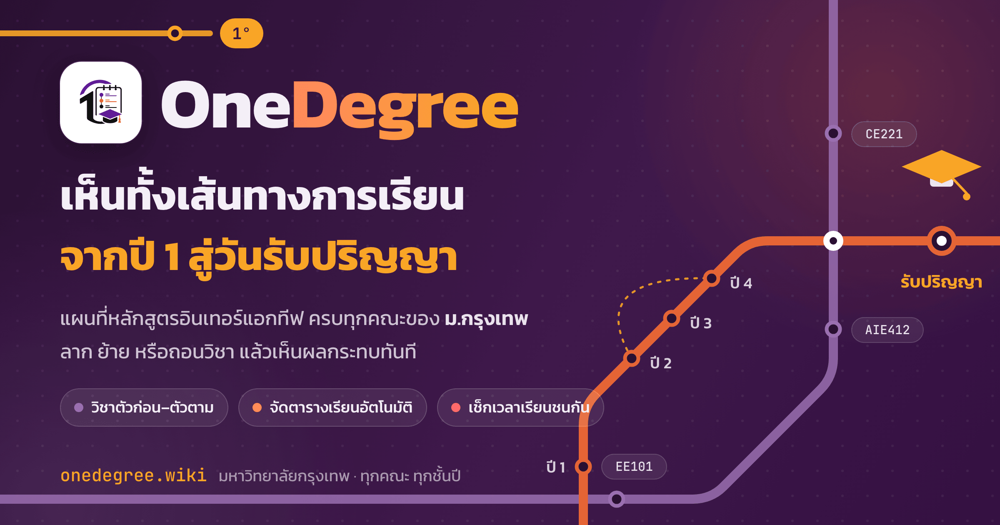

<div align="center">



# OneDegree

### แผนที่หลักสูตรมหาวิทยาลัยกรุงเทพ ดูเส้นทางการเรียนทั้งใบในหน้าเดียว

เลือกตั้งแต่ปี คณะ สาขา ไปจนถึงแผนการเรียน แล้วระบบจะวาดทุกเทอม ทุกวิชา และเส้นวิชาก่อนหลังออกมาให้เหมือนแผนที่รถไฟฟ้า


</div>

## ทำไมถึงสร้าง?

ผมเป็นนักศึกษามหาวิทยาลัยกรุงเทพครับ แล้วก็มีรุ่นน้องเดินมาถามเรื่องเดิม ๆ อยู่บ่อยมาก อย่างเช่น "พี่ เทอมหน้าลงตัวไหนได้บ้าง" "วิชานี้ต้องผ่านอะไรก่อนรึเปล่า" "แผนการเรียนปีนี้ไปทางไหนต่อ"

ปัญหาคือข้อมูลพวกนี้มันกระจายอยู่หลายเว็บมาก เว็บนึงไว้ดูรายวิชาที่เปิด อีกเว็บไว้ดูวิชาเสรี อีกที่ไว้ดูแผนการเรียน กว่าจะปะติดปะต่อได้ก็ตาลายไปหมด ผมเลยคิดว่ารวมมันมาไว้ที่เดียวเลยน่าจะดีกว่า

OneDegree เลยเกิดมาเพื่อสองอย่าง

1. เอาแผนการเรียนทั้งหลักสูตรมากางเป็นแผนที่ เห็นทุกเทอม ลากวิชาเล่นได้ ลองถอนวิชาดูว่ากระทบตัวไหนบ้าง
2. รวมลิงก์สำคัญที่รุ่นน้องและตัวผมเองต้องใช้บ่อย เอาไว้ในที่เดียว จะได้ไม่ต้องไล่หาทีละเว็บอีก

อยากให้รุ่นน้องเปิดดูแล้วเข้าใจเส้นทางการเรียนของตัวเองได้เร็ว ๆ ไม่ต้องมานั่งถามพี่ทีละคนแล้ว

## รวมลิงก์สำคัญ

ลิงก์ที่ผมใช้บ่อยสุดเวลาวางแผนลงทะเบียน เอามาไว้ในแอปให้กดได้เลย ไม่ต้องจำ

| ลิงก์ | เอาไว้ทำอะไร |
|---|---|
| [รายวิชาที่เปิดสอนและที่นั่งคงเหลือ](https://ursa2.bu.ac.th/seat/seat1.cfm) | เช็กว่าเทอมนี้เปิดตัวไหน ที่นั่งเต็มยัง |
| [วิชาเสรีที่เปิด](https://registration.bu.ac.th/thai/free-elective-courses) | หาวิชาเสรีมาเติมหน่วยกิต |
| [สำนักทะเบียน](https://registration.bu.ac.th) | ปฏิทินการศึกษา ลงทะเบียน เรื่องเอกสาร |
| [เว็บหลักมหาวิทยาลัยกรุงเทพ](https://www.bu.ac.th) | ข่าวสาร คณะ หลักสูตร |

## ทำอะไรได้บ้าง

เลือกหลักสูตรทีละขั้น ตั้งแต่ปี คณะ สาขา แทร็ก ไปจนถึงแผนการเรียน แบบไม่งง

แผนที่เป็นแบบรถไฟฟ้า แต่ละเทอมคือสถานี เส้นวิชาก่อนหลังคือเส้นทางรถไฟ ลากซูมเลื่อนได้ทั้งจอ

เห็นวิชาก่อนหลังเป็นเส้นโยง วิชาไหนต้องผ่านก่อน วิชาไหนเรียนควบคู่ได้ ลากเส้นให้หมด

ลองถอนวิชาได้ พอกดถอนแล้ววิชาที่ได้รับผลกระทบเป็นลูกโซ่จะเด้งเป็นสีแดงทันที เห็นเลยว่าพังตรงไหน

ลากย้ายวิชาเพื่อจัดเทอมใหม่เองได้ ถ้าวางผิดลำดับวิชาก่อนหลัง ระบบจะเตือนให้

ใช้ได้ทุกจอ ทั้งมือถือ แท็บเล็ต และคอม

## ดีไซน์

ธีมเป็นแผนที่รถไฟฟ้า ใช้สีประจำมหาวิทยาลัยกรุงเทพเป็นแกนหลัก

สีม่วง 3F194B เป็นสีหลัก ใช้กับเส้น timeline สถานี และตัวแบรนด์ ส่วนสีส้ม E56436 เป็นสีเสริม ใช้กับปุ่ม จุดเด่น และมอชั่นต่าง ๆ เส้นวิชาก่อนหลังเป็นสีม่วงคราม วิชาที่ถูกถอนเป็นสีแดง และวิชาที่จัดลำดับผิดเป็นสีเหลืองอำพัน

ตั้งใจใส่มอชั่นให้รู้สึกมีชีวิต อย่างแสงวิ่งบนเส้น timeline สถานีเต้นเบา ๆ และการ์ดเด้งแบบสปริง แต่ก็ยังคุมโทนให้ดูเป็นทางการ ถ้าเครื่องไหนตั้งค่า prefers reduced motion ไว้ มอชั่นพวกนี้จะปิดให้อัตโนมัติ

## รันเลย

ถ้ามี Docker ก็จบครับ คอนเทนเนอร์เดียวเสิร์ฟทั้งหน้าเว็บและ API

```bash
docker compose up --build
```

แล้วเปิด http://localhost:6729 (host 6729 ไปที่ container 8000)

```
หน้าเว็บ      /
API           /api/v1/degree-plan, /api/v1/health, /api/v1/metadata
เอกสาร API    /docs
```

## รันแบบ dev (ไม่ใช้ Docker)

ฝั่ง Backend เป็น FastAPI ถ้ามีโฟลเดอร์ Server/static อยู่ มันจะเสิร์ฟหน้าเว็บที่ build แล้วให้ด้วย

```bash
cd Server
pip install -r requirements.txt
uvicorn app.main:app --reload --port 8000
```

ฝั่ง Frontend ต่อกับ backend ที่รันอยู่

```bash
cd Web
npm install
npm run dev
```

โดยปกติ frontend จะยิง API ไปที่ /api/v1 ซึ่งเป็น origin เดียวกัน ถ้าจะแยก deploy คนละโฮสต์ ให้ตั้งค่า NEXT_PUBLIC_API_BASE ตอน build

```bash
NEXT_PUBLIC_API_BASE=https://bu.need.cat/api/v1 npm run build
```

## ข้างในมีอะไรบ้าง

```
OneDegree/
├── Dockerfile           build หน้าเว็บเป็น static แล้วให้ Python เสิร์ฟ API กับ UI
├── docker-compose.yml   service เดียวจบ
├── Server/              FastAPI กับ SQLite (seed จาก curriculum_database.json)
│   ├── app/
│   └── curriculum_database.json
└── Web/                 Next.js (static export ตอน build)
    └── app/
        ├── page.tsx          state กับการดึงข้อมูล
        ├── components/
        │   ├── Picker.tsx    ตัวเลือกหลักสูตรแบบทีละขั้น (hero กับ modal)
        │   ├── TopBar.tsx    แถบบนและสรุปแผนที่เลือกไว้
        │   └── Canvas.tsx    แผนที่ ลากซูม และเส้นวิชาก่อนหลัง
        └── globals.css       ธีม metro ทั้งหมด คุมด้วย CSS variables
```

Stack ที่ใช้คือ Next.js 16 กับ React 19 เขียนด้วย TypeScript ฝั่งหลังบ้านเป็น FastAPI กับ SQLAlchemy เก็บข้อมูลใน SQLite และห่อด้วย Docker

หน้าเว็บกับ API อยู่ origin เดียวกัน เลยไม่ต้องตั้ง CORS ให้ปวดหัว ทุกอย่างวิ่งผ่านโปรเซสเดียวที่พอร์ต 8000

## API ย่อ ๆ

route หลักมีตัวเดียว ใช้ซ้ำไปเรื่อย ๆ ตามที่เลือก พอใส่ param ครบก็จะได้แผนการเรียนเต็ม ๆ กลับมา

```
GET /api/v1/degree-plan
GET /api/v1/degree-plan?academic_year=2568
GET /api/v1/degree-plan?academic_year=2568&faculty_slug=school-of-accounting
```

เป็น API แบบอ่านอย่างเดียว ไม่มีระบบ login ตั้งใจให้เปิดดูได้เลย

<div align="center">

ทำโดยนักศึกษามหาวิทยาลัยกรุงเทพคนนึง เผื่อมีประโยชน์กับรุ่นน้องบ้าง

ถ้าใครเอาไปต่อยอด หรือเจอบั๊กตรงไหน บอกได้เลยนะครับ

</div>
